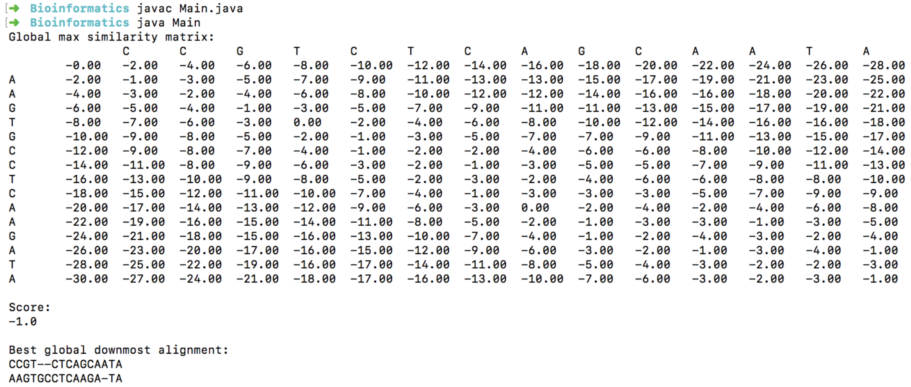
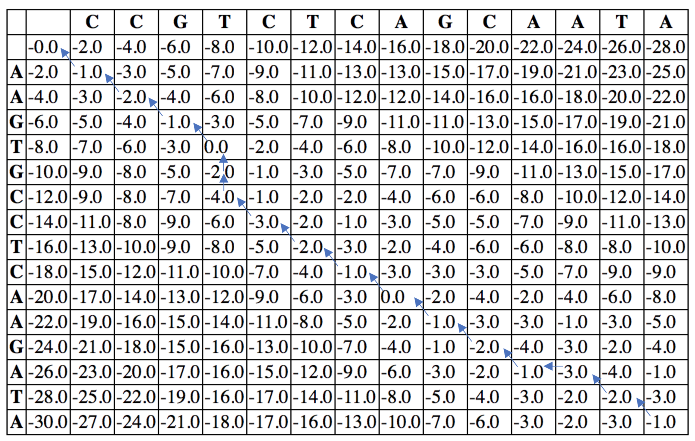

# Needleman-Wunsch

The [Needleman-Wunsch](https://en.wikipedia.org/wiki/Needleman%E2%80%93Wunsch_algorithm) algorithm employs dynamic programming in order to align nucleotide sequences.

This process involves two steps - firstly, calculating the global max similarity matrix, and secondly, tracing back from the bottom right corner of the matrix to find the best global alignment.

This implementation provides the best global downmost alignment.

#### Run demo:

```
>cd <local repo>
>javac Main.java
>java Main
```

#### Sample output:



The back trace from the sample program occurs as follows:


